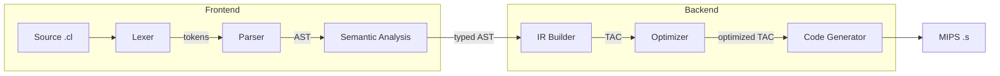

Un compilador [AOT](https://en.wikipedia.org/wiki/Ahead-of-time_compilation) para **[COOL](https://en.wikipedia.org/wiki/Cool_(programming_language))** (**L**enguaje **O**rientado a **O**bjetos para **C**lase), dirigido a la arquitectura MIPS de 32 bits y escrito completamente en Python 3.

**COOL** es un pequeño lenguaje orientado a objetos con tipado estático, que es seguro en tipos y cuenta con recolección de basura. Tiene principalmente 3 tipos de datos primitivos: Enteros, Cadenas y Booleanos (`true`, `false`). Soporta flujo de control condicional e iterativo, además de coincidencia de patrones. ¡Todo en COOL es una expresión! Se pueden encontrar muchos programas de ejemplo de COOL en el directorio [/examples](/examples/README.md).

Una especificación basada en BNF de la Gramática Libre de Contexto de COOL se encuentra en [/docs/Grammar.md](/docs/Grammar.md). Un manual de referencia de una página con ejemplos de sintaxis se puede encontrar [aquí](https://dijkstra.eecs.umich.edu/eecs483/crm/One%20Page.html).

## Contenido

  * [Características del lenguaje](#language-features)
  * [Vista general del proyecto](#project-overview)
    + [Arquitectura](#architecture)
    + [Cómo funciona](#how-it-works)
  * [Estado de desarrollo](#development-status)
  * [Cómo instalar](#how-to-install)
    + [Requisitos](#requirements)
    + [Instalación de SPIM](#installing-spim)
    + [Instalación desde el código fuente](#installing-from-source)
  * [Cómo usar](#how-to-use)
    + [Como aplicación independiente](#standalone)
    + [Módulos de Python](#python-modules)
    + [Comandos del Makefile](#makefile-commands)
  * [Cómo probar](#how-to-test)
  * [Referencias](#references)
  * [Licencia](#license)

## Características del lenguaje

  * Tipos de datos primitivos:
    + Enteros
    + Cadenas de texto
    + Booleanos (`true`, `false`)
  * Orientado a objetos:
    + Declaración de clases
    + Instanciación de objetos
    + Herencia
    + Atributos de clase
    + Métodos de clase
  * Tipado estático fuerte
  * Coincidencia de patrones
  * Flujo de control:
    + Switch Case
    + If/Then/Else
    + Bucles While
  * Gestión automática de memoria:
    + Recolección de basura (planificada)

## Vista general del proyecto

### Arquitectura

PyCOOLC sigue una arquitectura de compilador clásica con componentes de Frontend y Backend:



| Etapa | Módulo | Descripción |
|-------|--------|-------------|
| Léxer | [`lexer.py`](/pycoolc/lexer.py) | Tokenizador basado en expresiones regulares |
| Analizador sintáctico | [`parser.py`](/pycoolc/parser.py) | Analizador LALR(1), construye el AST |
| Análisis semántico | [`semanalyser.py`](/pycoolc/semanalyser.py) | Verificación de tipos, análisis de ámbito, herencia |
| Generador de IR | [`ir/`](/pycoolc/ir/) | Código de Tres Direcciones, Grafo de Flujo de Control, SSA |
| Optimizador | [`optimization/`](/pycoolc/optimization/) | Propagación de constantes, análisis de viveza, eliminación de código muerto |
| Generador de código | [`codegen.py`](/pycoolc/codegen.py) | MIPS de 32 bits con tablas de despacho y entorno de ejecución |

### Cómo funciona

Programa COOL:

```cool
class Main inherits IO {
   main(): Object { out_string("Hello!\n") };
};
```

1. **Léxer** → `CLASS`, `TYPE(Main)`, `INHERITS`, `TYPE(IO)`, `{`, ...
2. **Analizador sintáctico** → AST con `Program → Class → ClassMethod`
3. **Análisis semántico** → Verifica los tipos de la llamada a `out_string`, resuelve la herencia de `IO`
4. **Generación de código** → Ensamblador MIPS con despacho a `IO.out_string`

## Estado de desarrollo

Cada etapa del compilador y característica del entorno de ejecución está diseñada como un componente independiente que puede usarse de forma aislada o como un módulo de Python. A continuación se muestra el estado de desarrollo de cada uno:

| Etapa del compilador | Módulo de Python                               | Estado                      |
|:---------------------|:--------------------------------------------|:----------------------------|
| Análisis léxico      | [`lexer.py`](/pycoolc/lexer.py)             | :white_check_mark: **completado** |
| Análisis sintáctico  | [`parser.py`](/pycoolc/parser.py)           | :white_check_mark: **completado** |
| Análisis semántico   | [`semanalyser.py`](/pycoolc/semanalyser.py) | :white_check_mark: **completado** |
| Optimización         | [`optimization/`](/pycoolc/optimization/)   | :white_check_mark: **completado** | 
| Generación de código | [`codegen.py`](/pycoolc/codegen.py)         | :white_check_mark: **completado** |
| Recolección de basura | -                                           | :construction: planificado      |

## Cómo instalar

### Requisitos

 * Python >= 3.12
 * SPIM - Simulador de ensamblador MIPS de 32 bits (ver: [Instalación de SPIM](#installing-spim)).
 * Todos los paquetes de Python listados en: [`requirements.txt`](requirements.txt).

### Instalación de SPIM

SPIM es un simulador autocontenido que ejecuta programas MIPS32. Lo necesitarás para ejecutar el código ensamblado compilado.

**Descarga:** Obtén la última versión desde [SourceForge](https://sourceforge.net/projects/spimsimulator/files/).

**macOS:**

```bash
# Download and install QtSpim
curl -LO https://sourceforge.net/projects/spimsimulator/files/QtSpim_9.1.24_mac.mpkg.zip
unzip QtSpim_9.1.24_mac.mpkg.zip
open QtSpim_9.1.24_mac.mpkg

# Or use the command-line spim (if installed via homebrew or from source)
brew install spim  # if available
```

**Linux (Debian/Ubuntu):**

```bash
# Download the .deb package
wget https://sourceforge.net/projects/spimsimulator/files/qtspim_9.1.24_linux64.deb
sudo dpkg -i qtspim_9.1.24_linux64.deb
```

**Windows:**

Descarga `QtSpim_9.1.24_Windows.msi` desde [SourceForge](https://sourceforge.net/projects/spimsimulator/files/QtSpim_9.1.24_Windows.msi/download) y ejecuta el instalador.

### Instalación desde el código fuente

```bash
# Clone the repository
git clone https://github.com/aalhour/pycoolc.git
cd pycoolc

# Create and activate virtual environment
python3 -m venv .venv
source .venv/bin/activate

# Install dependencies and the package
pip install -e .
```

O usa el Makefile:

```bash
make venv
source .venv/bin/activate
```

## Cómo usar

### Como aplicación independiente

Información de ayuda y uso:

```bash
pycoolc --help
```

Compilar un programa COOL:

```bash
pycoolc hello_world.cl
```

Compilar múltiples archivos juntos (las clases pueden referenciarse entre sí):

```bash
pycoolc atoi.cl atoi_test.cl -o atoi_test.s
```

Especificar un nombre personalizado para el programa de salida compilado:

```bash
pycoolc hello_world.cl --outfile helloWorldAsm.s
```

Ejecutar el programa compilado (código máquina MIPS) con el simulador SPIM:

```bash
spim -file helloWorldAsm.s
```

O con QtSpim (GUI):

```bash
qtspim helloWorldAsm.s
```

Omitir la generación de código (solo verificar tipos):

```bash
pycoolc hello_world.cl --no-codegen
```

Ver representaciones intermedias:

```bash
pycoolc hello_world.cl --tokens     # Show lexer output
pycoolc hello_world.cl --ast        # Show parsed AST
pycoolc hello_world.cl --semantics  # Show typed AST
```

### Módulos de Python

```python
from pycoolc.lexer import make_lexer
from pycoolc.parser import make_parser
from pycoolc.semanalyser import make_semantic_analyser
from pycoolc.codegen import make_code_generator

# Lexical analysis
lexer = make_lexer()
lexer.input(a_cool_program_source_code_str)
for token in lexer:
    print(token)

# Parsing
parser = make_parser()
ast = parser.parse(a_cool_program_source_code_str)
print(ast)

# Semantic analysis
analyzer = make_semantic_analyser()
typed_ast = analyzer.transform(ast)

# Code generation
codegen = make_code_generator(analyzer)
mips_code = codegen.generate(typed_ast)
print(mips_code)
```

### Comandos del Makefile

```bash
make help              # Show all available targets
make venv              # Create virtual environment
make install           # Install package in development mode
make unit-tests        # Run unit tests
make integration-test  # Run integration tests with SPIM
make test              # Run all tests
make clean             # Clean build artifacts
```

## Cómo probar

PyCOOLC tiene una cobertura de pruebas exhaustiva en todas las fases del compilador:

```bash
# Run all unit tests
make unit-tests

# Run integration tests (requires SPIM)
make integration-test

# Run everything
make test
```

## Referencias

  * Engineering a Compiler, Cooper and Torczon - [Amazon](https://www.amazon.com/dp/012088478X)
  * Modern Compiler Implementation in ML, Appel - [www](https://www.cs.princeton.edu/~appel/modern/ml/), [Amazon](https://www.amazon.com/dp/0521607647)
  * Stanford's Compiler Theory Course - [www12](https://web.stanford.edu/class/archive/cs/cs143/cs143.1128/), [www16](http://web.stanford.edu/class/cs143/), [YouTube](https://www.youtube.com/playlist?list=PLDcmCgguL9rxPoVn2ykUFc8TOpLyDU5gx)


## Licencia

Este proyecto está licenciado bajo la [Licencia MIT](LICENSE).

Todos los derechos de autor de los archivos y documentos en el directorio [/docs](/docs) pertenecen a sus propietarios originales.
