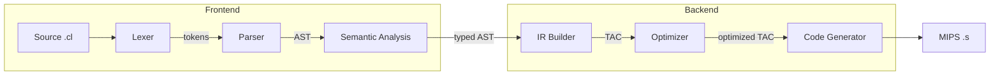

An [AOT](https://en.wikipedia.org/wiki/Ahead-of-time_compilation) compiler for **[COOL](https://en.wikipedia.org/wiki/Cool_(programming_language))** (**C**lassroom **O**bject **O**riented **L**anguage), targeting the MIPS 32-bit Architecture and written entirely in Python 3.

**COOL** is a small statically-typed object-oriented language that is type-safe and garbage collected. It has mainly 3 primitive data types: Integers, Strings and Booleans (`true`, `false`). It supports conditional and iterative control flow in addition to pattern matching. Everything in COOL is an expression! Many example COOL programs can be found under the [/examples](/examples/README.md) directory.

A BNF-based specification of **COOL**'s Context-Free Grammar can be found at [/docs/Grammar.md](/docs/Grammar.md).


------------------------------

## CONTENTS

  * [Overview](#overview).
    + [Architecture](#architecture).
    + [Example Scenario](#example-scenario).
  * [Development Status](#dev-status).
  * [Installation](#installation).
    + [Requirements](#requirements).
    + [Installing SPIM](#installing-spim).
    + [Installing from Source](#installing-from-source).
    + [Installing from PyPI](#installing-from-pypi).
  * [Usage](#usage).
    + [Standalone](#standalone).
    + [Python Module](#python-module).
    + [Makefile Targets](#makefile-targets).
  * [Language Features](#language-features).
  * [Testing](#testing).
  * [Literature](#literature).
  * [License](#license)

------------------------------


## OVERVIEW

### Architecture:

PyCOOLC follows classical compiler architecture with Frontend and Backend components:



| Stage | Module | Description |
|-------|--------|-------------|
| Lexer | [`lexer.py`](/pycoolc/lexer.py) | Regex-based tokenizer |
| Parser | [`parser.py`](/pycoolc/parser.py) | LALR(1) parser, builds AST |
| Semantic Analysis | [`semanalyser.py`](/pycoolc/semanalyser.py) | Type checking, scope analysis, inheritance |
| IR Builder | [`ir/`](/pycoolc/ir/) | Three-Address Code, Control Flow Graph, SSA |
| Optimizer | [`optimization/`](/pycoolc/optimization/) | Constant propagation, liveness, dead code elimination |
| Code Generator | [`codegen.py`](/pycoolc/codegen.py) | MIPS 32-bit with dispatch tables and runtime |

### How It Works:

COOL Program:

```cool
class Main inherits IO {
   main(): Object { out_string("Hello!\n") };
};
```

1. **Lexer** → `CLASS`, `TYPE(Main)`, `INHERITS`, `TYPE(IO)`, `{`, ...
2. **Parser** → AST with `Program → Class → ClassMethod`
3. **Semantic Analysis** → Type-checks `out_string` call, resolves `IO` inheritance
4. **Code Generation** → MIPS assembly with dispatch to `IO.out_string`


## DEV. STATUS

Each Compiler stage and Runtime feature is designed as a separate component that can be used standalone or as a Python module, the following is the development status of each one:

| Compiler Stage     | Python Module                               | Status                      |
|:-------------------|:--------------------------------------------|:----------------------------|
| Lexical Analysis   | [`lexer.py`](/pycoolc/lexer.py)             | :white_check_mark: **done** |
| Parsing            | [`parser.py`](/pycoolc/parser.py)           | :white_check_mark: **done** |
| Semantic Analysis  | [`semanalyser.py`](/pycoolc/semanalyser.py) | :white_check_mark: **done** |
| Optimization       | [`optimization/`](/pycoolc/optimization/)   | :white_check_mark: **done** | 
| Code Generation    | [`codegen.py`](/pycoolc/codegen.py)         | :white_check_mark: **done** |
| Garbage Collection | -                                           | :construction: planned      |


## INSTALLATION

### Requirements

 * Python >= 3.12
 * SPIM - MIPS 32-bit Assembly Simulator (see: [Installing SPIM](#installing-spim)).
 * All Python packages listed in: [`requirements.txt`](requirements.txt).

### Installing SPIM

SPIM is a self-contained simulator that runs MIPS32 programs. You'll need it to execute the compiled assembly output.

**Download:** Get the latest version from [SourceForge](https://sourceforge.net/projects/spimsimulator/files/).

**macOS:**

```bash
# Download and install QtSpim
curl -LO https://sourceforge.net/projects/spimsimulator/files/QtSpim_9.1.24_mac.mpkg.zip
unzip QtSpim_9.1.24_mac.mpkg.zip
open QtSpim_9.1.24_mac.mpkg

# Or use the command-line spim (if installed via homebrew or from source)
brew install spim  # if available
```

**Linux (Debian/Ubuntu):**

```bash
# Download the .deb package
wget https://sourceforge.net/projects/spimsimulator/files/qtspim_9.1.24_linux64.deb
sudo dpkg -i qtspim_9.1.24_linux64.deb
```

**Windows:**

Download `QtSpim_9.1.24_Windows.msi` from [SourceForge](https://sourceforge.net/projects/spimsimulator/files/QtSpim_9.1.24_Windows.msi/download) and run the installer.

### Installing from Source

```bash
# Clone the repository
git clone https://github.com/aalhour/pycoolc.git
cd pycoolc

# Create and activate virtual environment
python3 -m venv .venv
source .venv/bin/activate

# Install dependencies and the package
pip install -e .
```

Or use the Makefile:

```bash
make venv
source .venv/bin/activate
```

### Installing from PyPI

```bash
pip install pycoolc
```


## USAGE

### Standalone

Help and usage information:

```bash
pycoolc --help
```

Compile a COOL program:

```bash
pycoolc hello_world.cl
```

Compile multiple files together (classes can reference each other):

```bash
pycoolc atoi.cl atoi_test.cl -o atoi_test.s
```

Specify a custom name for the compiled output program:

```bash
pycoolc hello_world.cl --outfile helloWorldAsm.s
```

Run the compiled program (MIPS machine code) with the SPIM simulator:

```bash
spim -file helloWorldAsm.s
```

Or with QtSpim (GUI):

```bash
qtspim helloWorldAsm.s
```

Skip code generation (type-check only):

```bash
pycoolc hello_world.cl --no-codegen
```

View intermediate representations:

```bash
pycoolc hello_world.cl --tokens     # Show lexer output
pycoolc hello_world.cl --ast        # Show parsed AST
pycoolc hello_world.cl --semantics  # Show typed AST
```


### Python Module

```python
from pycoolc.lexer import make_lexer
from pycoolc.parser import make_parser
from pycoolc.semanalyser import make_semantic_analyser
from pycoolc.codegen import make_code_generator

# Lexical analysis
lexer = make_lexer()
lexer.input(a_cool_program_source_code_str)
for token in lexer:
    print(token)

# Parsing
parser = make_parser()
ast = parser.parse(a_cool_program_source_code_str)
print(ast)

# Semantic analysis
analyzer = make_semantic_analyser()
typed_ast = analyzer.transform(ast)

# Code generation
codegen = make_code_generator(analyzer)
mips_code = codegen.generate(typed_ast)
print(mips_code)
```


### Makefile Targets

```bash
make help              # Show all available targets
make venv              # Create virtual environment
make install           # Install package in development mode
make unit-tests        # Run unit tests
make integration-test  # Run integration tests with SPIM
make test              # Run all tests
make clean             # Clean build artifacts
```


## LANGUAGE FEATURES

  * Primitive Data Types:
    + Integers.
    + Strings.
    + Booleans (`true`, `false`).
  * Object Oriented:
    + Class Declaration.
    + Object Instantiation.
    + Inheritance.
    + Class Attributes.
    + Class Methods.
  * Strong Static Typing.
  * Pattern Matching.
  * Control Flow:
    + Switch Case.
    + If/Then/Else.
    + While Loops.
  * Automatic Memory Management:
    + Garbage Collection (planned).


## TESTING

PyCOOLC has comprehensive test coverage across all compiler phases:

```bash
# Run all unit tests
make unit-tests

# Run integration tests (requires SPIM)
make integration-test

# Run everything
make test
```


## LITERATURE

  * Engineering a Compiler, Cooper and Torczon - [Amazon](https://www.amazon.com/dp/012088478X)
  * Modern Compiler Implementation in ML, Appel - [www](https://www.cs.princeton.edu/~appel/modern/ml/), [Amazon](https://www.amazon.com/dp/0521607647)
  * Stanford's Compiler Theory Course - [www12](https://web.stanford.edu/class/archive/cs/cs143/cs143.1128/), [www16](http://web.stanford.edu/class/cs143/), [YouTube](https://www.youtube.com/playlist?list=PLDcmCgguL9rxPoVn2ykUFc8TOpLyDU5gx)


## LICENSE

This project is licensed under the [MIT License](LICENSE).

All copyrights of the files and documents under the [/docs](/docs) directory belong to their original owners.
